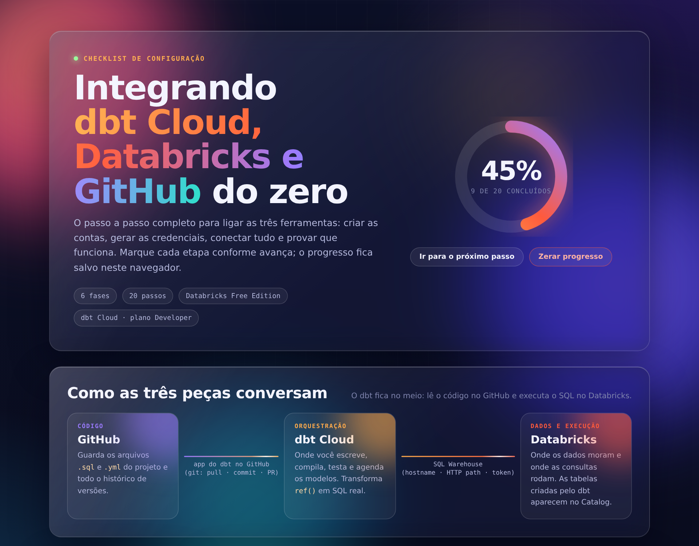

# Integração dbt Cloud + Databricks + GitHub

Painel interativo com o passo a passo completo para integrar **dbt Cloud**, **Databricks** e **GitHub** do zero, até o primeiro `dbt run` funcionando.

🔗 **Acesse o painel:** https://guchert.github.io/dbt-databricks-github-guia/dbt-databricks-guithub-guia.html
ou baixe o arquivo dbt-databricks-guithub-guia.html e abra em qualquer navegador.



## O que tem no painel

- **20 passos em 6 fases:** GitHub, Databricks, dbt Cloud, ligação dbt ↔ GitHub, validação e produção (opcional)
- **Percentual de conclusão:** um anel de progresso que avança conforme você marca cada etapa (fica salvo no seu navegador)
- **Checkpoints de validação:** como confirmar que cada integração realmente funciona
- **Mapa de credenciais:** onde pegar e onde colar hostname, HTTP path, catalog, token e schema
- **Solução de problemas:** erro 401 Unauthorized, token expirado, GitHub que não aparece no dbt, schema errado e catálogo

## Como as peças se conectam

```
GitHub  ──(app do dbt: pull · commit · PR)──▶  dbt Cloud  ──(SQL Warehouse: hostname · HTTP path · token)──▶  Databricks
 código                                        orquestração                                                   dados e execução
```

## O erro mais comum

```
401 Unauthorized: Credential was not sent or was of an unsupported type for this API
```

Na maioria das vezes, é o **Token ID** (64 caracteres) colado no lugar do **token** de acesso, que sempre começa com `dapi`. O token só aparece uma vez, na hora em que é gerado.

## Como usar

- **Online:** abra o link acima.
- **Offline:** baixe o `dbt-databricks-guithub-guia.html` e abra no navegador. Funciona sem internet (só as fontes web não carregam).

## Tecnologias

HTML, CSS e JavaScript puros, sem frameworks e sem dependências, basta abrir o .html em seu navegador.

## Autor

**Leonardo Güchert Miranda**, profissional de TI, analista de dados em transição para analytics engineering.

Sugestões e correções sempre são bem-vindas: abra uma *issue* ou um *pull request*.

## Licença

Distribuído sob a licença MIT. Veja o arquivo [LICENSE](LICENSE).
